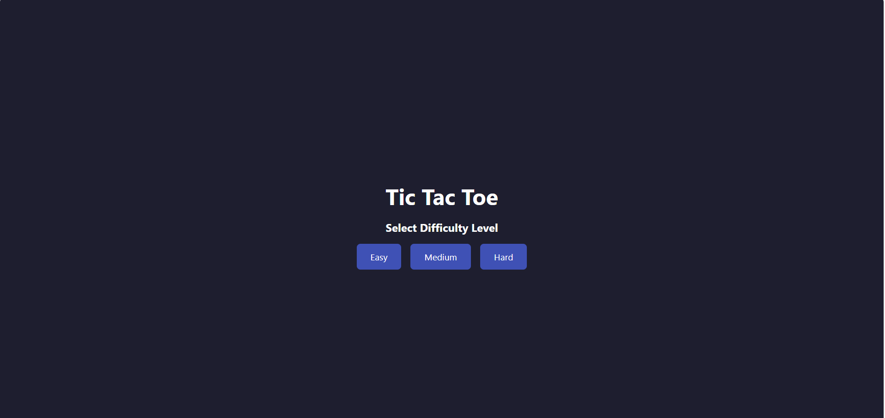
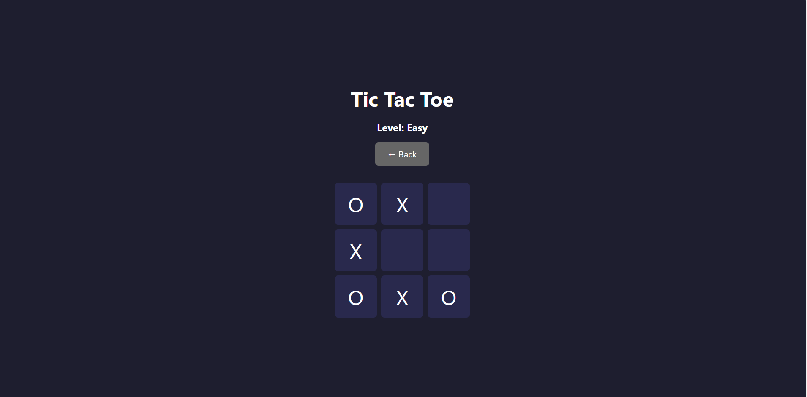

# 🎮 Tic Tac Toe Web Game

A fun, animated **Tic Tac Toe** game built with **Python (Flask)** on the backend and **HTML, CSS, and JavaScript** on the frontend. Play against an AI opponent with different difficulty levels!

---

## 🚀 Features

✅ User vs Machine gameplay  
✅ Three difficulty levels:
- **Easy** → Random moves
- **Medium** → Medium AI difficulty
- **Hard** → Unbeatable with Minimax algorithm  
✅ Responsive web UI  
✅ Smooth animations for moves  
✅ Displays winner or draw message  
✅ Play again or go back to main menu  
✅ Clean Python + JS codebase

---

## 🎥 Demo
Main Menu

Game Board

---

## 📂 Project Structure

tic-tac-toe/
│
├── app.py
├── requirements.txt
├── README.md
├── .gitignore
│
├── templates/
│ ├── index.html
│ └── game.html
│
└── static/
├── css/
│ └── style.css
├── js/
│ └── game.js
└── images/
├── game_screenshot.png
└── any_other_images.png

## ⚙️ Installation

Clone the repository:

git clone https://github.com/Sagnik120/tic-tac-toe.git
cd tic-tac-toe

🖥️ Run the App

Start the Flask app:
python app.py

🕹️ How to Play
Visit the home page and select your difficulty level.

Click cells to place your “X”.

The AI responds with “O”.

Win, lose, or draw!

Click Play Again or Back to switch levels.

📸 Screenshots
Main Menu

Game Board

💻 Technologies Used
Python 3

Flask

HTML5

CSS3

Vanilla JavaScript

Minimax Algorithm

## 🚀 Live Demo

Check out the live application here: [Tic Tac Toe ](https://tic-tac-toe-game-qs1i.onrender.com)

✨ Author
Sagnik Chandra

